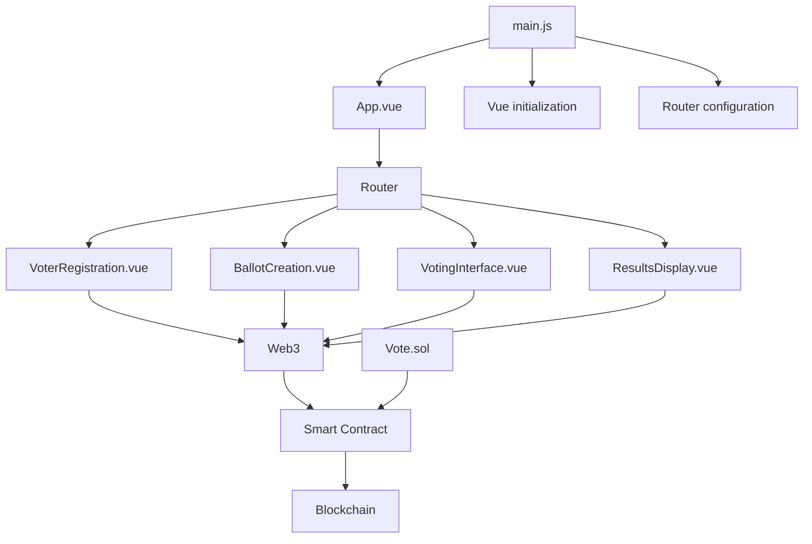
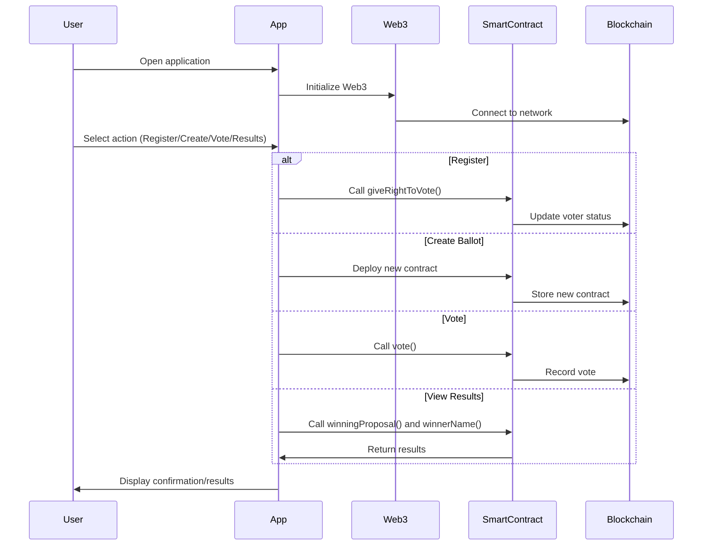

[](https://github.com/gongahkia/netero/releases/tag/1.0) 

# `Netero`

Decentralized voting platform powered by blockchain.

> TODO edit the below

* Vue for the frontend
* Truffle and Ganache for the backend blockchain contract logic
* Python for the other backend

## Usage

Instructions below are for local hosting.

```console
$ cd src
$ python3 main.py
$ cd netero-app/
$ npm run serve
```

## Architecture

### Structure



### Overview



View `netero-app` at [localhost:8080](http://localhost:8080/).

## References

The name `Netero` is in reference to [Isaac Netero](https://hunterxhunter.fandom.com/wiki/Isaac_Netero) (アイザック＝ネテロ), the 12th Chairman of the [Hunter Association](https://hunterxhunter.fandom.com/wiki/Hunter_Association). His death in the [Chimera Ant arc](https://hunterxhunter.fandom.com/wiki/Chimera_Ant_arc) at the hands of Chimera Ant King [Meruem](https://hunterxhunter.fandom.com/wiki/Meruem) directly trigger the events of the [13th Hunter Chairman Election arc](https://hunterxhunter.fandom.com/wiki/13th_Hunter_Chairman_Election_arc), as part of the the ongoing manga series, [HunterXhunter](https://hunterxhunter.fandom.com/wiki/Hunterpedia).

