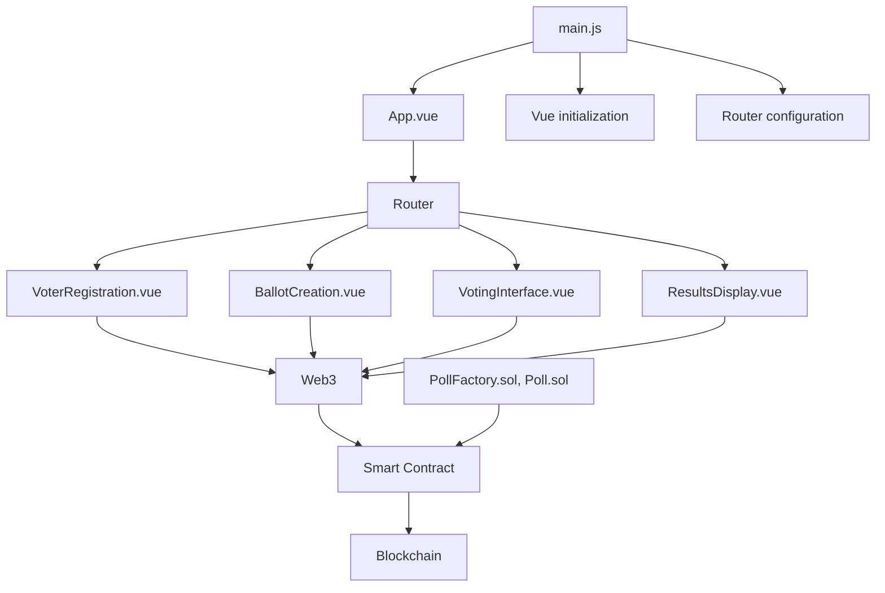
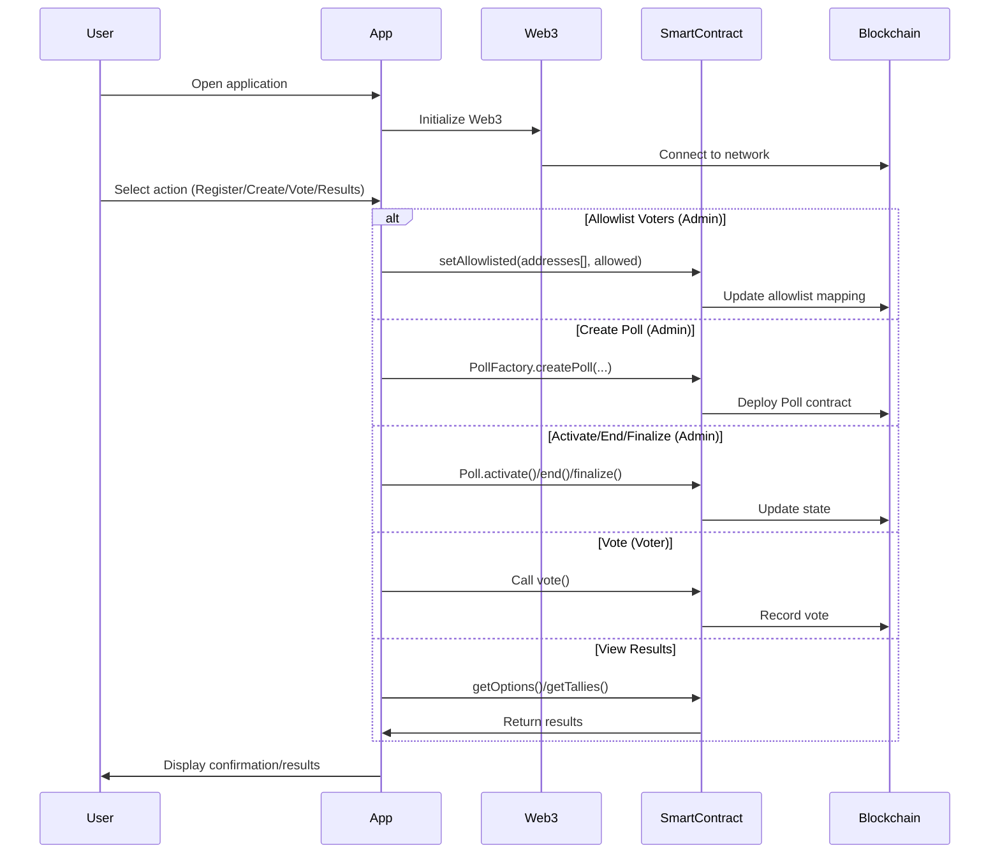

[](https://github.com/gongahkia/netero/releases/tag/1.0.0) 
[](https://github.com/gongahkia/netero/releases/tag/2.0.0)

# `Netero`

Decentralized voting platform powered by the blockchain.

## Stack

* *Frontend*: [Vue.js](https://vuejs.org/) 
* *Backend*: [Python](https://www.python.org)
* *Smart Contract Middleware*: [Truffle](https://archive.trufflesuite.com/), [Ganache](https://archive.trufflesuite.com/ganache/), [Solidity](https://soliditylang.org/) 

## Usage

Instructions below are for local hosting with a local Ethereum node like [Ganache]().

1. Install the [MetaMask](https://metamask.io/) Browser Extension.
    1. [Chrome Extension](https://chromewebstore.google.com/detail/metamask/nkbihfbeogaeaoehlefnkodbefgpgknn?hl=en&pli=1)
    2. [Firefox  Extension](https://addons.mozilla.org/en-US/firefox/addon/ether-metamask/)
    3. [Microsoft Edge Extension](https://microsoftedge.microsoft.com/addons/detail/metamask/ejbalbakoplchlghecdalmeeeajnimhm?hl=en-US)
    4. [Brave Extension](https://support.metamask.io/configure/wallet/using-metamask-wallet-in-brave-browser/)

2. Run the below commands to spin up a local Docker instance.
```console
$ docker-compose up --build
$ docker-compose --profile indexer up --build
```

3. Connect to the local network with the following details.
    1. **Network Name**: Any string
    2. **New RPC URL**: *http://localhost:8545* 
    3. **Chain ID**: *1337* 
    4. **Currency Symbol**: *ETH*
4. Start a local chain and deploy contracts.

```console
$ git clone https://github.com/gongahkia/netero && cd netero/src/core && npx truffle compile
$ python3 main.py
$ cd netero-app && npm install && npm run serve
```

5. View `netero-app` at [localhost:8080](http://localhost:8080/).

## Screenshots


## Architecture

### Structure



### Overview



## References

The name `Netero` is in reference to [Isaac Netero](https://hunterxhunter.fandom.com/wiki/Isaac_Netero) (アイザック＝ネテロ), the 12th Chairman of the [Hunter Association](https://hunterxhunter.fandom.com/wiki/Hunter_Association). His death in the [Chimera Ant arc](https://hunterxhunter.fandom.com/wiki/Chimera_Ant_arc) at the hands of Chimera Ant King [Meruem](https://hunterxhunter.fandom.com/wiki/Meruem) directly trigger the events of the [13th Hunter Chairman Election arc](https://hunterxhunter.fandom.com/wiki/13th_Hunter_Chairman_Election_arc), as part of the the ongoing manga series, [HunterXhunter](https://hunterxhunter.fandom.com/wiki/Hunterpedia).


