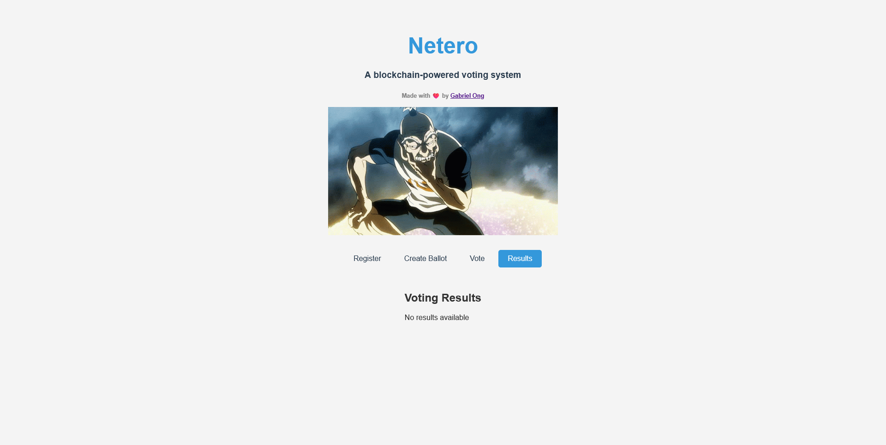

[](https://github.com/gongahkia/netero/releases/tag/1.0.0) 
[](https://github.com/gongahkia/netero/releases/tag/2.0.0)
[](https://github.com/gongahkia/netero/releases/tag/2.1.0)

# `Netero`

Decentralized voting platform powered by the blockchain.

For the [stack used](#tech-used).

## ✨ New in v2.1.0

- **📊 Org Overview Chart**: Subgraph-backed analytics showing votes over time across all polls
- **⚡ Gasless Voting Badge**: Visual indicator when meta-transactions are enabled (ERC-2771)
- **🔐 Enhanced Commit-Reveal UX**: 
  - One-click salt copy button
  - Encrypted local backup with download/import
  - Better visual feedback and workflow

See [FEATURES.md](./FEATURES.md) for detailed documentation.

## 🐳 Docker Support

Netero can now be fully containerized and run on any device with Docker:

```bash
# Quick start
docker-compose up --build

# With subgraph indexer
docker-compose --profile indexer up --build
```

See [DOCKER.md](./DOCKER.md) for complete Docker deployment guide.

<div align="center">
    
</div>

## Usage

Instructions below are for local hosting with a local Ethereum node (Ganache).

1. Install the [MetaMask](https://metamask.io/) Browser Extension.
    1. [Chrome Extension](https://chromewebstore.google.com/detail/metamask/nkbihfbeogaeaoehlefnkodbefgpgknn?hl=en&pli=1)
    2. [Firefox  Extension](https://addons.mozilla.org/en-US/firefox/addon/ether-metamask/)
    3. [Microsoft Edge Extension](https://microsoftedge.microsoft.com/addons/detail/metamask/ejbalbakoplchlghecdalmeeeajnimhm?hl=en-US)
    4. [Brave Extension](https://support.metamask.io/configure/wallet/using-metamask-wallet-in-brave-browser/)
2. Create a new wallet or import an existing one.
3. Connect to the local network with the following details.
    1. **Network Name**: Any string
    2. **New RPC URL**: *http://localhost:8545* 
    3. **Chain ID**: *1337* 
    4. **Currency Symbol**: *ETH*
<<<<<<< HEAD
4. Run the project.

### Option A: Using the Orchestration Script (Recommended)

**For WSL/Linux/Mac:**
```console
$ git clone https://github.com/gongahkia/netero
$ cd netero
$ ./start.sh
```

**For Windows:**
```console
$ git clone https://github.com/gongahkia/netero
$ cd netero
$ start.bat
```

The orchestration script will automatically:
- Install dependencies if needed
- Start Ganache (local blockchain)
- Deploy smart contracts via Truffle
- Start the Vue.js frontend

### Option B: Manual Setup
=======
4. Start a local chain and deploy contracts.
>>>>>>> 4101ed0d25cc66c54228e09b78b052e0c78bf190

```console
$ git clone https://github.com/gongahkia/netero
$ cd netero/src
# 1) Compile contracts (one-time when contracts change)
$ (cd core && npx truffle compile)
# 2) Start Ganache and migrate PollFactory (keeps running)
$ python3 main.py
# 3) In a new terminal, start the Vue app
$ cd netero-app && npm install && npm run serve
```

5. View `netero-app` at [localhost:8080](http://localhost:8080/).

## Screenshots




## Tech used

`Netero` was built with the following stack.

* [Vue.js](https://vuejs.org/) for the frontend
* [Truffle](https://archive.trufflesuite.com/), [Ganache](https://archive.trufflesuite.com/ganache/) and [Solidity](https://soliditylang.org/) for the smart contract and local Ethereum deployment middleware
* Raw [Python](https://www.python.org/) for the backend 

## Architecture

### Structure


### Overview


## References

The name `Netero` is in reference to [Isaac Netero](https://hunterxhunter.fandom.com/wiki/Isaac_Netero) (アイザック＝ネテロ), the 12th Chairman of the [Hunter Association](https://hunterxhunter.fandom.com/wiki/Hunter_Association). His death in the [Chimera Ant arc](https://hunterxhunter.fandom.com/wiki/Chimera_Ant_arc) at the hands of Chimera Ant King [Meruem](https://hunterxhunter.fandom.com/wiki/Meruem) directly trigger the events of the [13th Hunter Chairman Election arc](https://hunterxhunter.fandom.com/wiki/13th_Hunter_Chairman_Election_arc), as part of the the ongoing manga series, [HunterXhunter](https://hunterxhunter.fandom.com/wiki/Hunterpedia).


